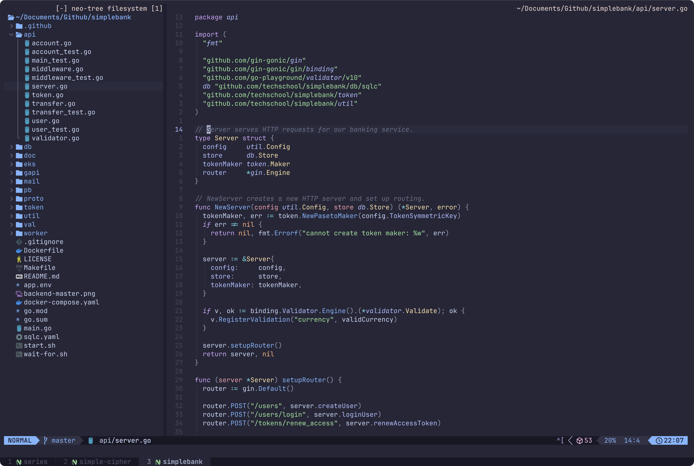

**My dotfiles**

Welcome to my personal dotfiles repository! Here, you'll find my custom configurations and scripts that shape my development environment.

- OS: macOS
- Editor: Neovim
- Terminal: WezTerm
- Multiplexer: Zellij
- Shell: zsh
- Theme: Catppuccin

Explore and tweak these settings to enhance your own workflow.

URL
